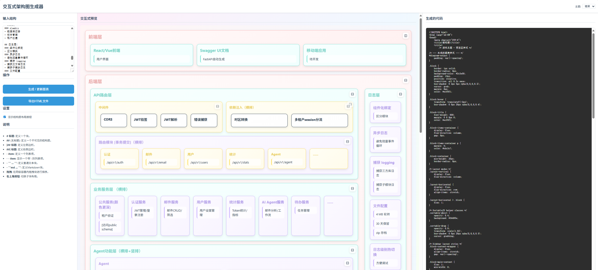

<div align="center">


# Structura 

**S**imuoss's **T**extual, **R**earrangeable & **U**niversal **C**harting **T**ool for **U**nified **R**endered **A**rchitecture

✨ 一个为AI时代设计的、所见即所得的交互式架构图生成工具 ✨

---

[**English**](#-english) | [**中文**](#-中文)

</div>

`<a name="-中文"></a>`

## 🇨🇳 中文

### 💡 Structura 是什么？

[Structura](http://structura.simuoss.cn) 是一款针对应用程序架构图而设计的，类似Markdown语法的，简单且适于LLM或人类阅读和编写的绘图语言，它能将一种简单而人类可读的语法，转换成美观、可交互、可自由重排的架构图。

像 Mermaid 或 PlantUML 这样的传统图表语言非常好用，但是它们都是为人类编写而设计的，虽然通用性很强，但较为复杂规则和语法却不利于人类学习，更重要的是，当前大模型并不能完全参透他们的语法。人工智能时代，AI写代码已经飞快了，我们不能把时间浪费在画图上，所以我们需要一种规则简单，适合大模型生成+人类快速调整的画图语言。**Structura** 正是为此而生。

### 🚀 实时演示与预览

查看交互式生成器的实际运行效果！

**(此处应有一个 GIF 动图，展示工具的核心功能：左侧输入文本，右侧实时渲染图表，用户拖动一个模块到新位置，一个容器的布局从垂直切换为水平，下方的代码预览随之立即更新。)**



### ✨ 核心功能

Structura 能够将您的想法以前所未有的速度和灵活性转化为清晰、美观且功能强大的架构图。

* **🤖 AI 优先，秒速出图**
  忘掉鼠标拖拽的繁琐吧！用最简单的文本描述您的架构，或者直接让 AI 大模型为您生成初稿。Structura 的语法对 AI 极其友好，这意味着您可以在几秒钟内得到一个完整的架构图，然后专注于迭代和优化，而不是从零开始。
* **↔️ 所见即所得，实时交互**
  这绝不是一张静态图片！在右侧预览区，每个模块都是**鲜活**的。直接用鼠标**拖拽排序**，点击右上角按钮即可在**水平/垂直布局**间丝滑切换。您的每一次调整，都会立刻反映在右侧代码中，实现了完美的双向同步。
* **🎨 精准控制，自由定制**
  您的图表，由您做主。通过简单的指令，您可以为任何模块**指定布局、修改颜色、自定义样式**。利用“隐形容器”，您可以轻松实现“一横两纵”等复杂布局，而不会在视觉上增加任何多余的元素。Structura 赋予您像素级的控制权，让图表精准表达您的设计。
* **📚 不只是方块，更是活文档**
  架构图不应只是空洞的标题。Structura 支持直接在模块内嵌入并渲染 **Markdown** 和**多行代码/文本块**。这意味着您的图表本身就是一份详尽、格式精美的设计文档，所有信息一目了然，无需在多个文件间来回切换。
* **🔗 万物皆可连（即将推出）**
  通过为模块设置唯一ID，您将能够轻松地在它们之间绘制**连接线**，清晰地展示数据流、依赖关系和调用链路，让您的架构图真正“活”起来。

### 📖 语法指南

Structura 的语法旨在简单直观。

#### 基础结构语法

> 只有两种基础语法： `#` 和 `-`。掌握这两种就够应付 **80%** 以上场景了！

| 语法                         | 描述                                                                                       |
| ---------------------------- | ------------------------------------------------------------------------------------------ |
| `# 标题`                   | 创建一个顶级模块。                                                                         |
| `## 标题`, `### 标题`... | 创建一个子模块（最多10级），嵌套进离自己最近的前一个母块里。可以循环嵌套。                 |
| `##` (无标题)              | 创建一个不可见的隐形容器，可以作为一个不可见的母级使用，用于实现”一横两纵“这种复杂排布。 |
| `- 文本项`                 | 在模块内创建一个简单的文本项。                                                             |

#### 侧边栏语法

> 有时候，日志模块需要显示在一侧，贯穿其他模块。所以我们引入了 `|` 语法。
> 其实用不带标题的 `##` 结构块也可以实现这个效果，但是侧边块语法更加方便，也比 `##` 结构块更窄。

| 语法          | 描述             |
| ------------- | ---------------- |
| `##\| 标题`  | 创建左侧边栏块。 |
| `## 标题 \|` | 创建右侧边栏块。 |

#### 块属性语法

> - 有时候我们想直接在代码里控制块是横排还是纵排
> - 有时候我们想修改块的颜色
> - 有时候我们想给块起个名字（用来拉箭头）
> - 所以我们引入了 `:` 语法和 `{}` 语法

| 语法                                                             | 描述                                                                                                      |
| ---------------------------------------------------------------- | --------------------------------------------------------------------------------------------------------- |
| `## 标题 :my-id`                                               | 为块设置自定义ID。                                                                                        |
| `## 标题 r:`                                                   | 应用横向布局。                                                                                            |
| `## 标题 c:`                                                   | 应用纵向布局。                                                                                            |
| `## 标题 c:my-id`                                              | 同时设置ID并应用纵向布局。                                                                                |
| `## 标题 {style="background-color: red;"}`                     | 为块应用自定义CSS样式。这里填写的style属性会直接添加到块的style属性中。                                   |
| `## 标题 c:my-id {style="background-color: red;"}`             | 同时应用上面的所有功能。                                                                                  |
| `## 标题 {id=my-id, layout=c, style="background-color: red;"}` | 其实类似 `c:my-id` 这种语法是 `{}` 语法的语法糖。所以，我们其实可以直接在 `{}` 语法中完成所有事情。 |

#### 内容块语法

> 有没有可能，在内容块里面写Markdown呢？
> 我们引入了 ` ``` ` 语法。另外，为了方便写注释，我们还引入了 `//` 语法。

| 语法                    | 描述                               |
| ----------------------- | ---------------------------------- |
| \`\`\`文本块 \`\`\`     | 创建可以跨行的纯文本块。           |
| \`\`\`md  # 标题 \`\`\` | 创建跨越多行的Markdown渲染内容块。 |
| `//`                  | 添加注释（不在输出中显示）。       |

#### 完整示例

``````text
# 前端层{layout=r}
## React/Vue前端
- 学生和教师界面
## Swagger UI文档
- FastAPI自动生成课程 API 文档
## 移动端应用
- 学习助手 · 待开发

# 后端层

## API路由层{layout=c}

### {layout=c}
#### 中间件
##### CORS
##### JWT验签
##### JWT解析
##### 错误捕获

#### 依赖注入
##### 时区转换
##### 多租户session分流

### 路由模块 [事务提交]
#### 认证
-  /api/v1/auth  
#### 课程
- /api/v1/course
#### 用户
- /api/v1/users
#### 成绩
- /api/v1/grades
#### AI Tutor
- /api/v1/tutor
#### ......

## 业务服务层
### 公共服务{style="background-color: #89e6e1"}
- 租户验证
- [访问public schema]
### 认证服务
- JWT管理/登录注册  
### 课程服务
- 课程 CRUD/筛选
### 用户服务
- 学生/教师资料管理
### 成绩服务
- 考试成绩统计/指标
### AI Tutor 服务
- 作业批改/学习建议
### 待办服务
- 任务管理
### ......

## Agent功能层{layout=c}

### Agent
#### 工作流模式 - 节约token·效果稳定
##### 作业批改Agent
- 批量模式
##### 学习报告分析Agent
##### ......
#### Agent模式 - 功能强大·自由度高
##### 课程推荐Agent
##### 风险监测Agent
##### 学习答疑Agent
- 即时问答模式
##### ......

###
#### Agent工具
##### 联网搜索
##### 网页浏览
##### 文件下载
##### 知识检索
##### 相似检索
##### ....

#### MCP C/S
##### 本地 MCP Server
##### 云端 MCP Server
##### 本地 MCP Client

#### 知识库
##### 知识导入
##### 知识管理
##### 知识编排
##### 层级构建

### 模型管理
- AzureOpenAI · Qwen · ChatGLM · Kimi · Claude · OpenAI · Doubao · ......
#### LLMs/MultiModal-LLMs
#### Embeddings
#### Reranks
#### ASR
#### TTS
#### ......

##
### 外部集成层
#### 邮件适配器
- Microsoft Graph
- IMAP/POP3
- ...
#### IM软件适配器
- 企业微信
- 飞书
- ...
#### 教育系统适配器
- Blackboard
- Moodle
- ...
#### Agent适配器
- Dify
- n8b
- ...

### 异步任务层
- Celery Worker
#### 定时任务
##### 成绩计算
##### 数据同步
##### 报表生成
#### 异步任务
##### Agent任务
##### 作业批改
##### 学习分析

## 数据访问层

### Repository模式
- 对象关系映射 · 业务逻辑 · 事务管理
#### 课程repo
#### 公共repo
#### 用户repo
#### ......

### ORM模型
- SQLAlchemy 2.0 · 区分schema · 支持Alembic迁移
#### 用户模型
#### 课程模型
#### 成绩模型
#### ......

## 日志层 {layout=c}|
### 组件化绑定
- 区分模块
### 异步日志
- 避免阻塞事件循环
### 捕获 logging
- 捕获三方库日志
- 捕获子模块日志
### 文件配置
- 4 MB 轮转
- 30 天保留
- zip 存档
### 日志级别热切换
- 方便调试
### 协程崩溃捕获
- 防止"任务静默失败"

## 数据存储层
### PostgreSQL
- 主数据库
- 多租户Schema级强隔离
### MongoDB
- 存储课件文件
- 存储低热持久大集合
### Redis
- 缓存/会话
- JWT黑名单
- Celery
### Alembic
- 数据库迁移
- 版本管理
- 租户创建

# 部署层{layout=r}
## Docker
- 所有组件容器化
- 自动初始化数据库
- 自动初始化测试租户
- 自动初始化测试用户
## Docker Compose
- 便捷部署
## Nginx
- 支持API挂载

# 数据库连接信息 {layout=c}
## 配置信息
- ```text
- 主机: localhost
- 端口: 5432
```
## 其他信息
- ```md
**重要说明:**
- 使用连接池
- 启用SSL加密
```

// 这是注释，不会显示

```

``````

### 🤔 为什么选择 Structura?

尽管像 Mermaid 这样的工具非常出色，但它们生成的是静态图像。修改布局或结构需要重写代码。Structura 可以直接拖动块，或调节一些设置。

### 🛠️ 如何使用

直接访问：[Structura](http://structura.simuoss.cn)
所有处理均在前端进行，无需担心数据泄露风险

### 🗺️ 发展蓝图

Structura 才刚刚起步。以下是一些对未来的构想：

- [X] 主题和自定义样式语法
- [X] 颜色、边框、间距
- [ ] 位置、大小、形状、连接线
- [ ] 互有重叠的块
- [ ] 添加一个开关来切换图表/HTML/双列
- [ ] HTML可编辑，以及语法高亮。
- [ ] DSL、图表、HTML应该会互相更新
- [ ] 每个块支持图形化设置
- [ ] DSL语法高亮

- **[ ] 根据需求自动圈选系统架构范围并画出系统架构图的Agent**

### 📄 开源许可

本项目采用 GNU3.0 许可证。有关详细信息，请参阅 [LICENSE](LICENSE) 文件。

---

`<a name="-english"></a>`

## 🇬🇧 English

### 💡 What is Structura?

**Structura** is a simple, Markdown-like diagramming language designed for application architecture diagrams, suitable for both LLMs and humans to read and write. It transforms a simple, human-readable syntax into beautiful, interactive, and freely rearrangeable architecture diagrams.

Traditional diagramming languages like Mermaid or PlantUML are excellent but were designed for humans. While highly versatile, their relatively complex rules and syntax can be challenging for humans to learn. More importantly, current large models cannot fully grasp their syntax. In the age of AI, where writing code is incredibly fast, we shouldn't waste time on drawing diagrams. Therefore, we need a diagramming language with simple rules, perfectly suited for AI generation and rapid human refinement. **Structura was born for this purpose.**

more info comming soon...
